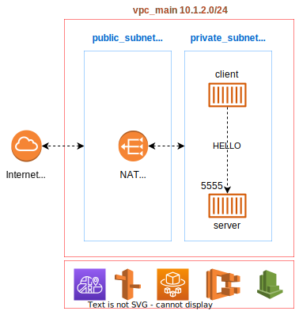
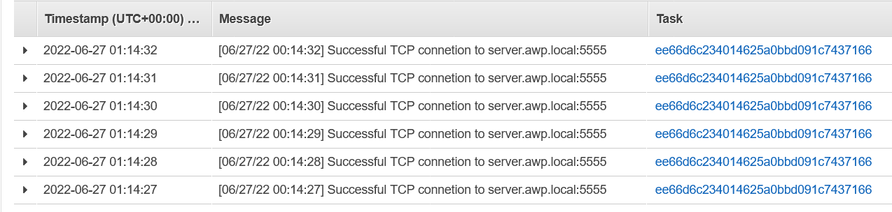

# awesome_challenge_terraform_fargate



The goal of this project is to auto provision an infrastructure consisting of a single ECS cluster with two separate tasks.

- Fist task would include the server container which is an simple socat server listening on TCP:5555 and would respond with a 'pong' message on each call.
- Second task would include the client container which also is made of the same socat image and would be using socat to call the server container on port 5555

### Challenges faced:

- To keep the containers light and easily debuggable I have used the alpine/socat container and the first challenge was to figure out how to create a client/server application with socat.
- Private VPC + ECS didn't work and Docker Image Pull failed on the tasks initially so I had to create a separate public subnet on the VPC and attach a NAT gateway to resolve this issue while keeping the private services secure.
- In order to avoid load-balancers (Challenge criteria). I investigated different ways to automate service discovery. I initially started by integrating the tasks with AWS App-Mesh which looked like Istio but due to some issue my service containers failed to load while Envoy sidecar was added to them. It took a lot of my time to debug the issue and due to the time limitation I decided not to continue with App Mesh.
- To have a properly working solution I decided to use Service Discovery. It is less flexible than the service mesh method but has less overhead on the instances.

### How to run:

- Modify `terraform.tfvars` based on your target deployment environment requirements.
- Load your aws keys:
  
  ```shell
  # On Linux:
  export AWS_ACCESS_KEY_ID=""
  export AWS_SECRET_ACCESS_KEY=""
  ```
  
  Other authentication methods are also available please refer to https://registry.terraform.io/providers/hashicorp/aws/latest/docs

- initiallize terraform:
  
  ```shell
  terraform init
  ```

- Check the plan
  
  ```shell
  terraform plan
  ```

- Apply the plan
  
  ```shell
  terraform apply
  ```

### How to test:

This terraform plan creates cloudwatch logs for the tasks. After 2-3 minutes you should see the logs showing up on the client mentioning that it has been successfully able to connect to the server.



The client uses private hosted domains defined in service discovery to find the server and connect to it.